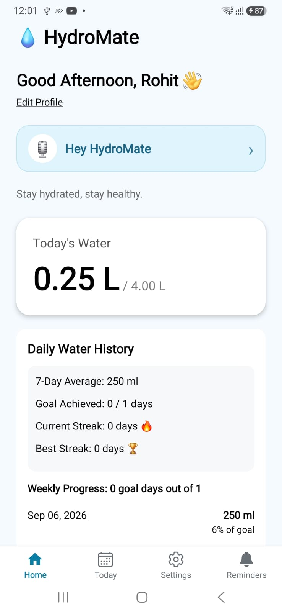
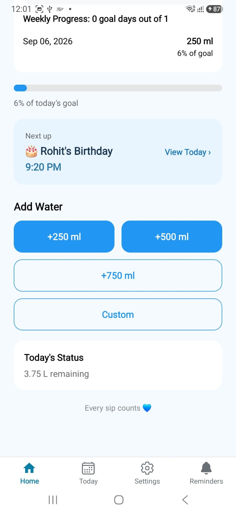
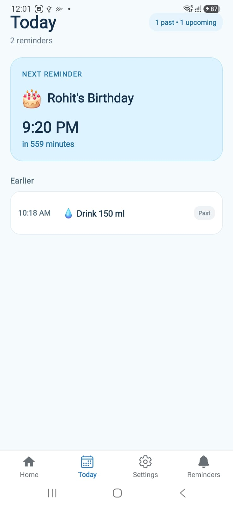
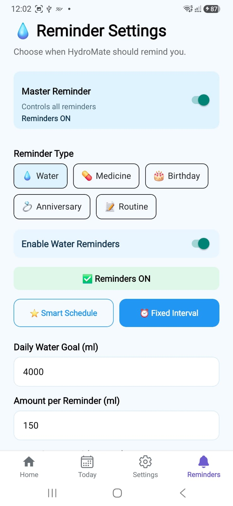
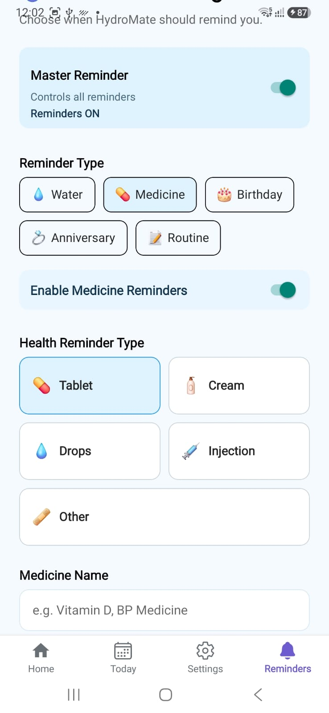
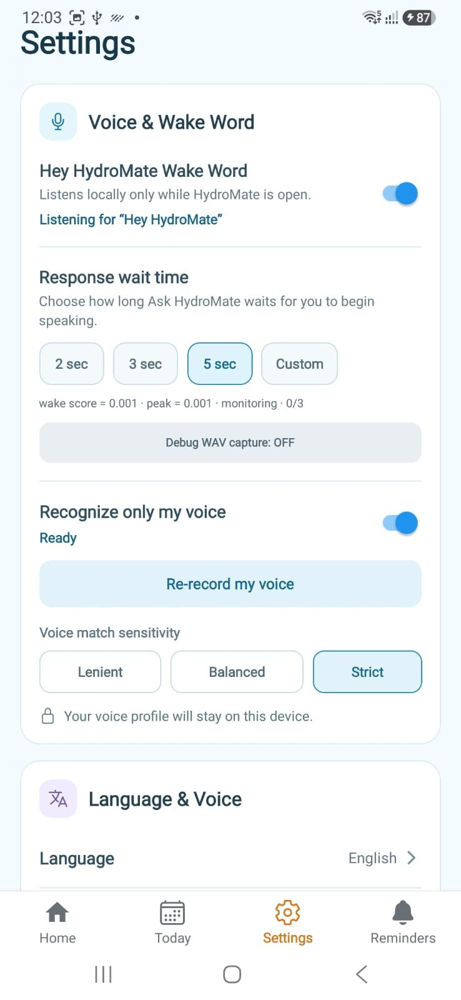

# 💧 HydroMate

### AI-Enabled Hydration & Health Reminder Assistant

HydroMate is a mobile health companion designed and built end-to-end to help users manage hydration, medicines, routines, and important health-related reminders through a simple and voice-enabled experience.

🎥 **Watch the 2.5-minute Product Demo:**  
[▶ Watch the HydroMate Product Demo](https://youtube.com/shorts/fuG_Lnh4kk0?feature=share)

---

## 🚀 Why I Built HydroMate

People often forget small but important daily health actions:

- Drinking enough water
- Taking medicines on time
- Following health routines
- Remembering recurring personal events

Most reminder apps provide basic notifications.

My goal with HydroMate was different:

> Build a more personal, intelligent, and voice-enabled daily health assistant.

---

## 🏠 Personalized Home Dashboard

HydroMate provides a personalized home screen with:

- User greeting
- Daily hydration goal
- Water consumption
- Remaining water
- Hydration history
- 7-day average
- Current streak
- Best streak
- Next scheduled reminder

Users can quickly add:

- +250 ml
- +500 ml
- +750 ml
- Custom amount

An undo mechanism also protects against accidental entries.

 

---

## 📅 Today Timeline

The Today Timeline provides one consolidated view of scheduled activities.

Users can quickly see:

- Past reminders
- Upcoming reminders
- Next reminder
- Reminder timing
- Reminder category

This reduces unnecessary navigation and gives users a clear view of their day.

---

## 🔔 Smart Reminder System

HydroMate supports multiple reminder categories:

- 💧 Water
- 💊 Medicine
- 🎂 Birthday
- 💍 Anniversary
- 📝 Routine / Custom reminders

Users can enable or disable individual categories while a Master Reminder controls the complete reminder system.

---

## 💧 Smart Hydration Scheduling

Hydration reminders support two modes:

### Smart Schedule
HydroMate calculates reminder timings based on user preferences and daily targets.

### Fixed Interval
Users can manually define:

- Daily water goal
- Amount per reminder
- Reminder interval
- Start time
- End time

The app calculates the planned reminders and daily hydration coverage.

---

## 💊 Medicine Reminders

Medicine reminders are designed for real daily health routines.

Users can configure:

- Medicine name
- Tablet
- Cream
- Drops
- Injection
- Other medication types
- Multiple reminder times
- 1 / 3 / 5 / 7 days
- Custom duration
- Ongoing medication

---

# 🎙 Ask HydroMate

Ask HydroMate introduces a more natural way to interact with reminders.

Users can:

- Speak a reminder
- Type a reminder
- Review recently created reminders
- Continue or update reminder plans
- Manage recurring health routines

> **Portfolio note:** Ask HydroMate is implemented and working; the UI is still being refined before adding a dedicated portfolio screenshot.

---

# 🧠 Custom “Hey HydroMate” Wake Word

One of the most advanced parts of the project is the custom wake-word system.

I trained a dedicated model for:

> **“Hey HydroMate”**

using **openWakeWord**.

The training process included:

- Positive training samples
- Adversarial negative phrases
- Background audio augmentation
- Room impulse response augmentation
- Feature generation
- False-positive validation
- 50,000-step model training
- ONNX export

The final model:

`hey_hydromate.onnx`

is designed for integration into the mobile application.

HydroMate can also:

- Listen locally while the app is open
- Recognize only the enrolled user's voice
- Adjust voice-match sensitivity
- Configure assistant response delay

---

# 📊 Hydration Analytics

HydroMate tracks:

- Daily water intake
- Goal completion
- 7-day average
- Weekly progress
- Current streak
- Best streak

This creates the foundation for future personalized hydration insights.

---

# 🛠 Technology Stack

### Mobile
- React Native
- Expo
- TypeScript
- Expo Router

### Backend & Authentication
- Firebase
- Phone OTP Authentication

### Storage
- AsyncStorage

### Notifications
- Expo Notifications
- Native scheduled reminders

### AI / Voice
- openWakeWord
- ONNX
- Native voice capabilities
- Voice profile matching

---

# 🧩 Product Ownership

HydroMate was designed and built end-to-end by **Rohit Sharma**.

My responsibilities included:

- Problem identification
- Product strategy
- Feature prioritization
- UX decisions
- User flows
- Technical architecture
- Development
- AI / voice experimentation
- Debugging
- Device testing
- Iteration
- Product roadmap

The project allowed me to work across the complete lifecycle:

> **Idea → Requirement → UX → Development → Testing → Iteration → Working Product**

---

# 🔐 Privacy

Voice-profile data is designed to remain on-device.

The custom wake-word experience is intended to support local listening while HydroMate is active.

---

# 🗺 Product Roadmap

Planned enhancements include:

- WhatsApp Care Mode
- Family / caregiver notifications
- Medicine Taken / Snooze / Skip
- Adaptive hydration recommendations
- Personalized health insights
- Enhanced Ask HydroMate intelligence
- Play Store production hardening

---

# 🎯 What This Project Demonstrates

HydroMate is not intended to be just a coding project.

It demonstrates my ability to:

- Identify a real user problem
- Define a product solution
- Prioritize features
- Work across UX and technology
- Build an MVP
- Solve technical problems
- Experiment with AI
- Test on real devices
- Iterate toward a production-ready product

---

## 👤 Built by

**Rohit Sharma**

Product Manager | FinTech | AI & Digital Products

LinkedIn: [Rohit Sharma](https://www.linkedin.com/in/rohit-sharma-453207245/)

Demo: [▶ Watch the HydroMate Product Demo](https://youtube.com/shorts/fuG_Lnh4kk0?feature=share)